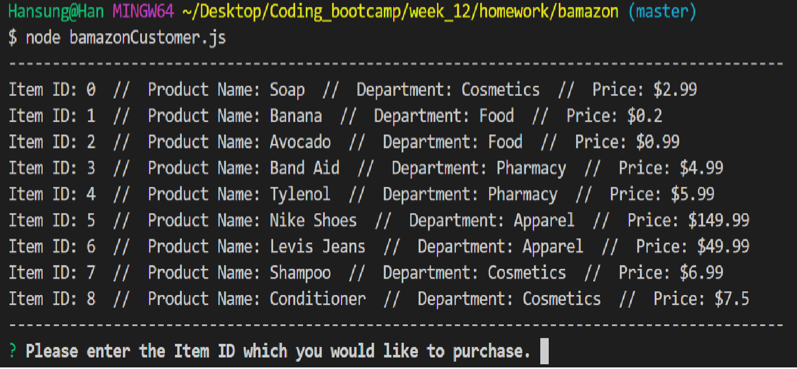
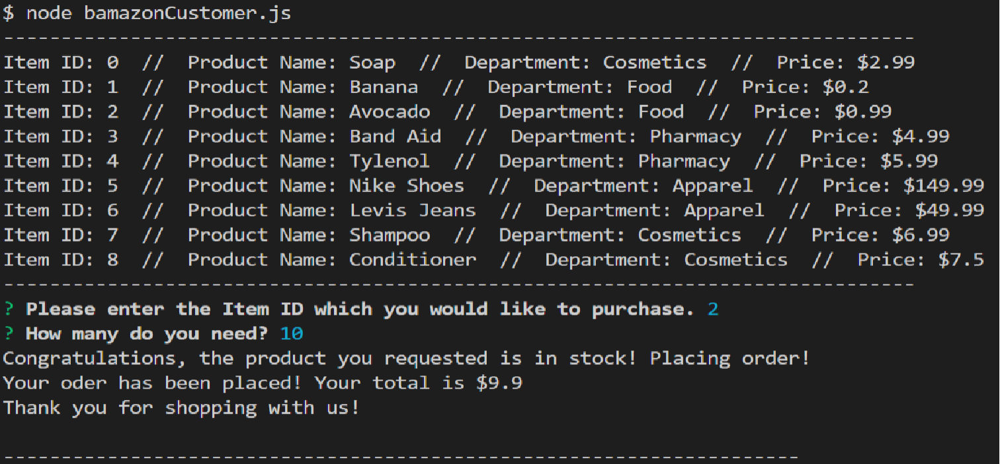
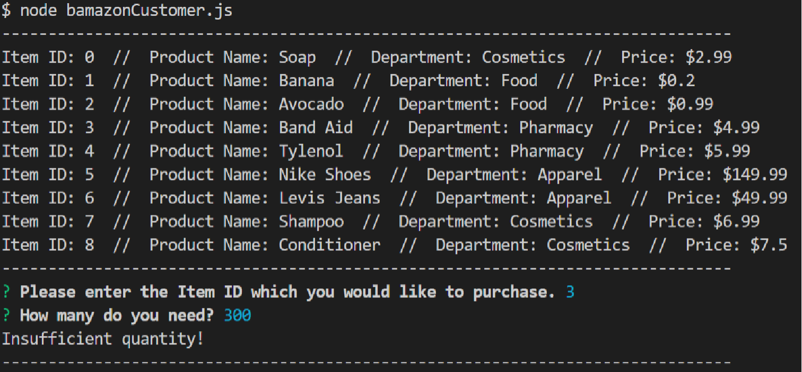
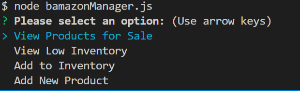
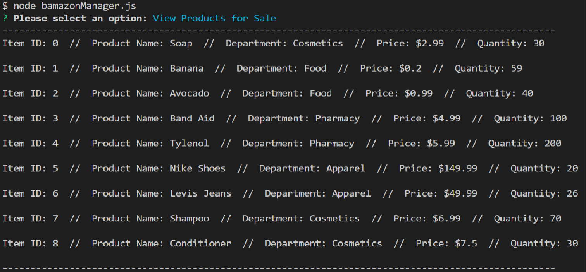
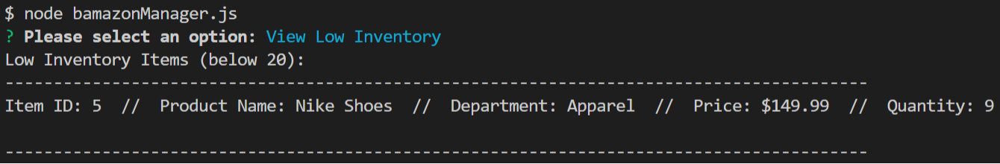
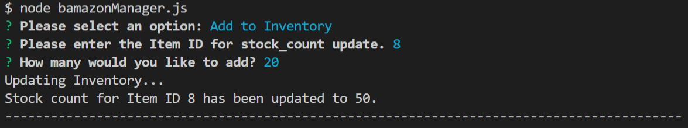
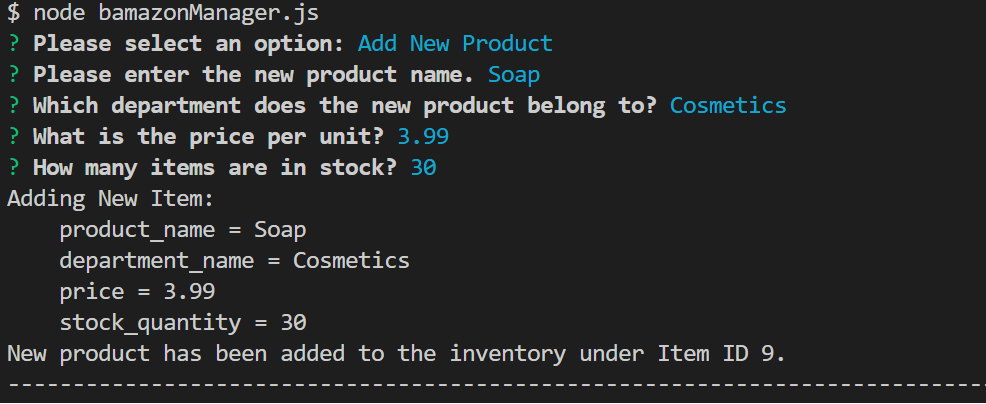

# Bamazon

In this repo are two applications, `bamazonCustomer.js` and `bamazonManager.js`.
For either of these to work you will first need to have `mySQL` and `requirer` installed.

```
npm install mysql
```
```
npm install inquirer
```

## Bamazon Demo

[Bamazon Demo](https://drive.google.com/file/d/1f6uZVn-gQWOZqSuR2ddPyFNVzwWkv-ql/view)

## Bamazon Customer

To run this:

```
node bamazonCustomer.js
```

1.



2.



3.



## Bamazon Manager

To run this:

```
node bamazonManager.js
```

1.



2.



3.



4.



5.

